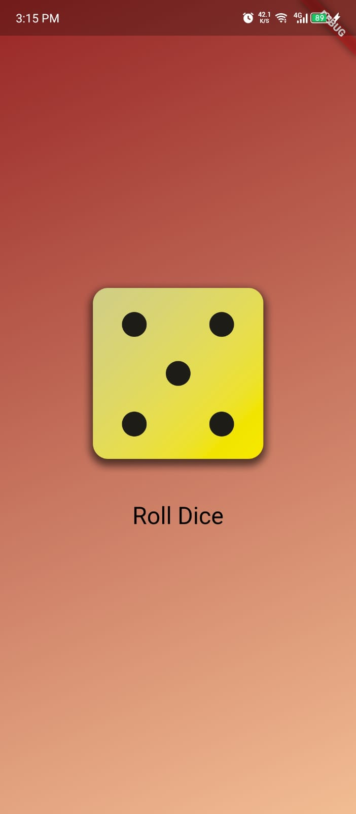
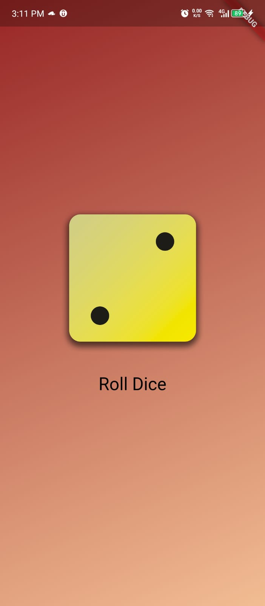

# role_dice_app

A dice roller Flutter project.

## About the App

This is a simple dice roller app built using Flutter. It allows users to roll a virtual dice and get a random number between 1 and 6.

## Features

- Roll the dice by tapping on the screen
- Display the rolled number on the screen

## Getting Started

To get started with this app, follow these steps:

1. Clone this repository: `git clone https://github.com/adzkykhairany/role_dice_app.git`
2. Navigate to the project directory: `cd role_dice_app`
3. Install the dependencies: `flutter pub get`
4. Run the app: `flutter run`

## Screenshots

  
  

## Contact

I'm new to Flutter, and if you are too, let's learn and explore it together! Feel free to reach out if you'd like to collaborate and share knowledge. You can contact me through my GitHub profile or by sending me an email at [adzkyykhairany@gmail.com](mailto:adzkyykhairany@gmail.com). 
Let's start this Flutter journey together!
